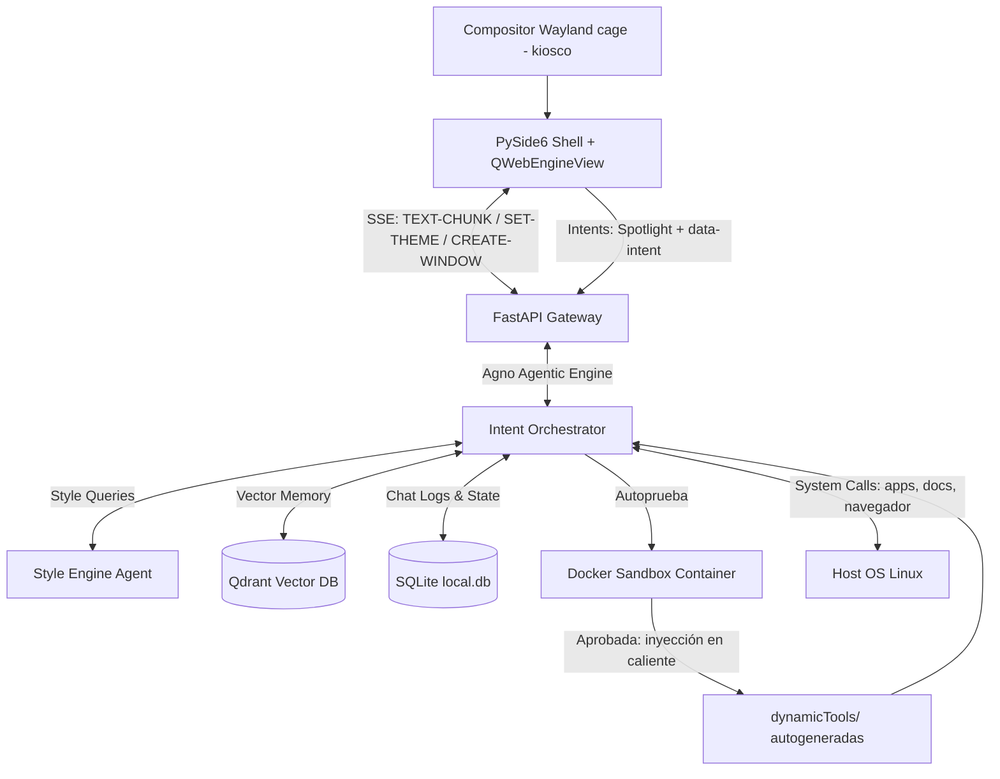

<div align="center">

  

  <h1>🧠 AGNUX OS v2.0</h1>

  <p><strong>Un Sistema Operativo Cognitivo, Autónomo y Autogenerador<br/>impulsado por PySide6, FastAPI, IA local y Aislamiento en Contenedores</strong></p>

  <p>
    <a href="https://pyside.org/">
      
    </a>
    <a href="https://fastapi.tiangolo.com/">
      
    </a>
    <a href="https://ollama.ai/">
      
    </a>
    <a href="https://qdrant.tech/">
      
    </a>
    <a href="https://www.docker.com/">
      
    </a>
  </p>

  <p>
    <a href="https://link.mercadopago.com.ar/angieydavid">
      
    </a>
    <a href="https://paypal.me/agnux">
      
    </a>
    
    
    
  </p>

  <br/>

  <blockquote>
    <em>"No construimos otro chatbot de IA. Diseñamos un Kernel de procesamiento cognitivo donde el LLM gobierna el espacio de usuario nativo y autogenera su propia interface."</em>
    <br/>
    — <strong>David González</strong> · 🇦🇷 Desde Argentina para el mundo
  </blockquote>

</div>

---

## 🧬 La Filosofía AGNUX: El Espacio de Usuario Autogestionado

Los sistemas operativos y entornos de escritorio tradicionales fueron diseñados como traductores estáticos entre comandos humanos y hardware. El usuario debe saber qué aplicación abrir, cómo configurarla y cómo encadenar comandos para lograr un objetivo.

**AGNUX** invierte este paradigma. Es un **Sistema Operativo Cognitivo**. 
* El espacio de usuario no es una rejilla rígida de iconos; es un **lienzo dinámico** en HTML5 que muta en tiempo real según las necesidades del usuario.
* La interfaz de comandos tradicional es reemplazada por un **agente conversacional nativo** empotrado en el fondo de pantalla (sistema widget interactivo).
* El sistema operativo no viene pre-cargado con herramientas estáticas para todo; tiene la **capacidad de programarse a sí mismo en caliente**, creando, testeando e inyectando nuevas herramientas ("Superpoderes") para resolver problemas sobre la marcha.

---

## ⚡ Características Principales y "Superpoderes"

El Kernel resuelve cada intención en lenguaje natural siguiendo una **estrategia de resolución en 3 niveles**: 1) usar una herramienta existente o una aplicación del host (abrir el navegador en una URL, redactar un documento y abrirlo en el editor, lanzar apps); 2) materializar la respuesta como **interfaz visual generada** (paneles, tablas, dashboards); 3) si ninguna herramienta puede resolverlo, **forjarse una a sí mismo**.

### 1. Sistema de Superpoderes (Self-Forge: Dynamic Tool Generation)
Cuando el usuario solicita una tarea para la cual AGNUX no tiene una herramienta registrada, el Kernel ejecuta su **pipeline de autogeneración** (`crearHerramienta`):
* **Generación de código + casos de prueba:** El orquestador escribe la función en Python junto a una batería de pruebas con `assert` sobre casos reales.
* **Autoprueba en Sandbox:** Definición y pruebas se ejecutan aisladas en un contenedor Docker (`core/sandbox.py`) sin acceso a red y con CPU/RAM limitadas. Si la autoprueba falla, la herramienta se **rechaza** y el agente recibe la salida del sandbox para corregir e iterar.
* **Inyección en Caliente:** Solo el código aprobado se inyecta en `backend/dynamicTools/` y se registra de inmediato en el arsenal del agente (`core/dynamicToolsLoader.py`), quedando invocable en ese mismo turno y en cada arranque posterior del Kernel.
* **Créditos y Origen:** El concepto y arquitectura de este sistema de autogeneración de herramientas dinámicas está inspirado en el proyecto **Superpowers** creado por **Jesse Vincent** ([github.com/obra/superpowers](https://github.com/obra/superpowers)).

### 1.b Interfaz Generativa e Interactiva (Generative UI)
El Kernel no responde solo con texto: **materializa interfaces**. Mediante la herramienta `crearVentana` emite el evento `CREATE-WINDOW` con **HTML libre** que se renderiza como una ventana de cristal nativa del shell:
* **Integración automática al tema:** El HTML generado hereda la identidad visual activa (tablas, barras de progreso, formularios y botones estilizados con las variables `--agnux-*`), en cualquier tema del Style Engine.
* **Actualización en vivo:** Reutilizando el mismo `ventanaId`, la IA refresca el contenido de una ventana abierta sin cerrarla (paneles de telemetría vivos).
* **Interactividad por intents (`data-intent`):** Cualquier botón, fila o tarjeta con `data-intent="petición en lenguaje natural"` dispara ese intent de vuelta al Kernel al hacer click, como si el usuario lo hubiera escrito. Los placeholders `{campo}` se interpolan con los valores de los inputs de la misma ventana — formularios funcionales sin una línea de JavaScript. El ciclo completo: *la IA crea la interfaz → el usuario la toca → el intent vuelve a la IA → la IA actualiza la interfaz*.
* **Saneamiento:** Los `<script>` se eliminan del HTML generado antes de insertarse en el DOM.

### 2. Motor de Estilos Semántico (Semantic Style Engine)
La estética de AGNUX no es fija. A través de consultas semánticas, el usuario puede pedir cambios visuales como *"Quiero un estilo cyberpunk con tonos neón violeta y bordes redondeados translúcidos"*. El agente de estilos de IA:
* Diseña y valida una hoja de estilos CSS en tiempo real.
* Inyecta el bloque CSS dinámicamente en el DOM del frontend en menos de **5ms** mediante Server-Sent Events (SSE).
* Almacena las configuraciones vectorizadas en la base de datos de recuerdos de Qdrant.

La identidad visual por defecto, **"Neural Vanguard"**, expresa el concepto cognitivo: un fondo aurora vivo que deriva lentamente, ventanas de cristal profundo con halo de acento al enfocar, una Hyperisland con shimmer perimetral permanente y el Spotlight como elemento héroe con anillo de gradiente giratorio. **Todo el diseño deriva de las variables `--agnux-*` vía `color-mix`**, por lo que un `SET-THEME` del Style Engine retematiza el 100% de la interfaz — aurora incluida — sin tocar una línea de CSS estructural.

### 3. Memoria Episódica y Semántica (Hybrid Memory Hub)
* **Memoria a Corto Plazo (Conversacional):** Historial de sesión de chat almacenado en una base SQLite local (`agnux.db` / `local.db`).
* **Memoria a Largo Plazo (Episódica/Semántica):** Integración nativa con **Qdrant Vector DB**. Los hechos clave de las interacciones anteriores se vectorizan usando `SentenceTransformers` locales, permitiendo que la IA recuerde datos del usuario en arranques posteriores (incluso corriendo desde un Live USB sin conexión a Internet).

### 4. Soberanía de Datos, Privacidad Total y Ejecución Local
Para asegurar la privacidad del usuario, AGNUX prioriza la inferencia local:
* **Ejecución 100% Local:** El procesamiento de lenguaje y lógica de comandos se realiza localmente en la GPU/CPU del usuario a través de **Ollama** (usando modelos como `qwen2.5-coder:7b`).
* **Cero Gasto de Tokens y Sin Fugas de Datos:** Toda tu información, conversaciones e interacciones del sistema permanecen en tu computadora. No se envía telemetría ni texto a servidores externos de terceros.
* **Cómputo Híbrido Opcional (Cloud):** Si el usuario requiere el máximo poder de razonamiento de modelos más grandes (o no cuenta con hardware GPU dedicado), puede configurar fácilmente proveedores en la nube como **Gemini** (Google Generative AI) o **OpenAI** simplemente completando su clave de API en el archivo `.env`.

### 5. HyperIsland & Kernel Bus
Un canal bidireccional mediante WebSockets y streams de telemetría en tiempo real que mantiene al usuario informado sobre el uso de recursos del hardware (CPU, VRAM, RAM, disco) y el estado del procesamiento cognitivo (tokens consumidos, estado de los agentes) directamente en un widget integrado al fondo de pantalla de forma fluida.

---

## 🔁 El Cambio de Arquitectura: ¿Por qué abandonamos Angular por PySide6 + HTML5 Native Shell?

En la versión v1.0, el escritorio de AGNUX se renderizaba como una aplicación SPA en **Angular** servida por Nginx, corriendo sobre un navegador Chromium en modo quiosco. Aunque proveía modularidad, esta aproximación introducía graves ineficiencias de rendimiento y limitaciones de integración del sistema que impedían su salida a producción.

Para la versión v2.0, decidimos realizar un **cambio de arquitectura radical**: implementamos un **Shell NATIVO en PySide6** que envuelve un `QWebEngineView` (Chromium Core embebido) cargando componentes puramente escritos en **HTML5 / CSS3 / Vanilla JS** localmente (`file://`).

### 🛠️ Razones Clave de la Migración

1. **Acceso Nativo al File System y Hardware:** Angular corre estrictamente en la Sandbox de seguridad del navegador web. Para realizar llamadas de sistema, cambiar el wallpaper o iniciar aplicaciones de escritorio (como el explorador de archivos o la terminal), se requería delegar por red mediante WebSockets. Con PySide6, el frontend carga de manera local y expone slots de ejecución Python nativos que cruzan la barrera del sandbox web al instante.
2. **Eliminación del Overhead del Servidor Web:** La arquitectura anterior dependía de Nginx corriendo localmente para compilar y resolver las rutas de Angular, aumentando el tiempo de arranque. La v2.0 carga el DOM directamente desde el disco rígido del sistema de archivos en descompresión del Casper Live USB, eliminando dependencias de red.
3. **Inyección en Tiempo Real del Motor de Estilos (Style Engine):** Angular compila sus hojas de estilo de manera estática y encapsulada (ViewEncapsulation). Inyectar código CSS sintetizado por IA sobre la marcha obligaba a actualizar el árbol completo o alterar variables globales forzando ciclos de detección de cambios (`Zone.js`). Con HTML5 + CSS3 vanilla, la inyección ocurre en menos de `5ms` editando un tag `<style>` del head del DOM.
4. **Simplificación en el Pipeline Bare-Metal (Live USB):** Angular añade miles de dependencias en `node_modules` y requiere transpilar código TS a JS. Al usar Vanilla JS + HTML5, el proceso de compilación de la ISO no requiere herramientas Node ni bundlers de frontend adicionales.

---

## 📊 Comparativa de Rendimiento

La optimización de recursos resultante de esta migración ha sido drástica, reduciendo drásticamente el consumo de memoria RAM y el tiempo de booteo:


### Tabla Comparativa de Recursos de Sistema

| Métrica / Recurso | Arquitectura Angular v1.0 (Nginx + Kiosk) | Arquitectura PySide6 + HTML5 v2.0 | Ganancia de Rendimiento |
| :--- | :---: | :---: | :---: |
| **Uso de Memoria RAM** | ~850 MB | **~320 MB** | **- 62.3% (Ahorro)** |
| **Overhead de VRAM (GPU)** | ~380 MB | **~150 MB** | **- 60.5% (Ahorro)** |
| **Boot a Interacción (B2I)** | 4.8 segundos | **0.8 segundos** | **6x más rápido** |
| **Tiempo de Hot-Reload (CSS)** | ~250 ms | **< 5 ms** | **Instantáneo** |
| **Procesos en Background** | 6 (Nginx, Chrome-tree, uvicorn) | **2 (Python process + QtWebEngine)** | **Simplificación** |

---

## 🏗️ Arquitectura del Sistema



---

## 📁 Estructura del Repositorio

* **`desktop/`**: Contiene `shell.py`, el shell en PySide6 que carga el frontend en un `QWebEngineView`. Bajo la sesión Wayland corre a pantalla completa como kiosco (`AGNUX_KIOSK=1`); sin esa variable arranca en modo ventana para desarrollo sobre cualquier escritorio.
* **`backend/`**: El core cognitivo desarrollado en FastAPI.
  * `main.py`: Punto de entrada de la API.
  * `core/tools.py`: Herramientas del sistema (navegador, documentos con editor, ventanas generativas, notificaciones, sandbox, autogeneración con `crearHerramienta`).
  * `core/sandbox.py`: Interfaz para instanciar contenedores Docker y validar código generado en caliente.
  * `core/dynamicToolsLoader.py`: Cargador que registra las herramientas autogeneradas de `dynamicTools/` al arrancar y tras cada inyección.
  * `dynamicTools/`: Herramientas forjadas por el propio Kernel tras aprobar su autoprueba en el sandbox.
  * `services/orchestrator.py`: Lógica de agentes utilizando el framework Agno.
* **`frontend/`**: La interfaz gráfica del escritorio basada en HTML5, CSS3 y Vanilla JS con la identidad "Neural Vanguard" (aurora viva, cristal profundo, superficies HTML generativas e intents `data-intent`).
* **`bare-metal/`**: Herramientas y scripts para la generación de la distribución autónoma del sistema operativo en formato ISO (remasterización sobre base KDE Neon), con sesión gráfica **100% Wayland** (compositor kiosco `cage`, sin Xorg) registrada en SDDM.

---

## 🚀 Despliegue e Instalación

### Requisitos Previos
* **OS:** Linux (Ubuntu/Debian recomendado para aceleración NVIDIA CUDA nativa).
* **Dependencias del Host:** Docker Engine (para el sandbox de herramientas), Python 3.10+, Qdrant (corriendo localmente o en contenedor).

### Ejecución Local

1. **Configurar el Entorno del Backend:**
   Crea un archivo `.env` en la raíz de la carpeta `backend/` siguiendo esta estructura:
   ```env
   iaProvider=local
   ollamaHost=http://127.0.0.1:11434
   qdrantHost=http://127.0.0.1:6333
   ```

2. **Instalar dependencias e iniciar FastAPI:**
   ```bash
   cd backend
   python3 -m venv venv
   source venv/bin/activate
   pip install -r requirements.txt
   python3 -m uvicorn main:app --port 8000 --host 127.0.0.1
   ```

3. **Lanzar el Escritorio Gráfico:**
   ```bash
   cd ../desktop
   python3 shell.py
   ```
   En un escritorio de desarrollo se abre en modo ventana (1280×800). Para reproducir la experiencia kiosco de la ISO en cualquier equipo con Wayland:
   ```bash
   QT_QPA_PLATFORM=wayland AGNUX_KIOSK=1 cage -s -- python3 shell.py
   ```

---

## 💿 Distribución Live USB Bare-Metal (Creación de la ISO)

AGNUX OS v2.0 puede compilarse en una distribución autónoma autoinstalable basada en **KDE Neon**. El proceso de compilación empaqueta los drivers propietarios de NVIDIA, configura el gestor de inicio **SDDM** para iniciar directamente en la sesión gráfica Wayland de AGNUX (compositor kiosco `cage` + PySide6 Shell) y precarga la imagen de Qdrant en formato tarball (`qdrant.tar`) para que funcione 100% sin conexión a Internet.

1. Navega al directorio de compilación física:
   ```bash
   cd bare-metal
   ```
2. Ejecuta el empaquetador del sistema:
   ```bash
   sudo ./repack-iso.sh
   ```
3. Esto generará el archivo `agnux-os-neon-v2.0.iso`. Grábalo en tu pendrive usando `dd`:
   ```bash
   sudo dd if=agnux-os-neon-v2.0.iso of=/dev/sdX bs=4M status=progress conv=fdatasync
   ```
   *(Reemplaza `/dev/sdX` por tu unidad USB real)*.

### 💎 ¿Por qué elegimos KDE Neon como base del sistema operativo?

Elegimos **KDE Neon (User Edition)** como la distribución base para remasterizar la ISO de AGNUX por tres razones técnicas fundamentales:
1. **Base Ubuntu LTS (Noble):** Ofrece máxima estabilidad a largo plazo, compatibilidad universal con binarios de Linux, paquetería Debian nativa y soporte directo y robusto para controladores de tarjetas gráficas NVIDIA y CUDA.
2. **Ecosistema Qt Nativo y Moderno:** KDE Neon proporciona por defecto las librerías compartidas de Qt más actualizadas. Como la interface gráfica de AGNUX está construida en **PySide6** (el puente oficial de Qt6 para Python), la compatibilidad binaria es del 100% y el rendimiento gráfico es óptimo, evitando empaquetar librerías extra que aumentarían el peso de la ISO.
3. **Gestión de Sesión con SDDM:** Emplea SDDM como display manager por defecto. Esto nos facilitó interceptar la inicialización gráfica en el live boot para forzar el autologin de forma modular y cargar nuestra sesión de usuario `agnux.desktop` (registrada en `/usr/share/wayland-sessions/`) y scripts de preparación de permisos sin alterar el instalador principal.

### 🖥️ Stack gráfico: Wayland + cage (sin Xorg)

La sesión de AGNUX corre **100% sobre Wayland** usando **`cage`**, un compositor kiosco minimalista de la familia wlroots: la shell PySide6 es la única superficie, a pantalla completa, sin gestor de ventanas visible. Beneficios directos frente al stack X11/Openbox anterior: **cero tearing** (cada frame llega completo), escalado HiDPI correcto, menor superficie de ataque y arranque más simple (un solo proceso compositor). El plugin Qt `wayland` viene incluido en PySide6, y las aplicaciones del host que la IA lanza (editor, explorador, terminal) se abren como superficies Wayland encima del kiosco. En equipos con NVIDIA, si la primera inicialización muestra pantalla negra, habilitar `nvidia-drm.modeset=1` en la línea de kernel de GRUB.

---

## 🤝 Apoya el Proyecto (Sponsorship)

AGNUX OS es un proyecto independiente desarrollado a pulmón. Si te gusta el concepto de sistemas cognitivos autónomos, te ha servido de base para tus proyectos o simplemente quieres apoyar las horas de café y cómputo de GPU destinadas a este desarrollo, puedes realizar una colaboración monetaria:

* **Transferencia (🇦🇷 Argentina):**
  * **Alias:** `agnuxArg`
* **PayPal (🌍 Global):**
  * **Link de Donación:** [paypal.me/agnux](https://paypal.me/agnux)

*¡Muchísimas gracias por el apoyo para seguir impulsando AGNUX!* 🇦🇷💡

---

## 📄 Licencia

Este proyecto está bajo la licencia **MIT**. Para más detalles, consulta el archivo [LICENSE](LICENSE) en el repositorio raíz.
