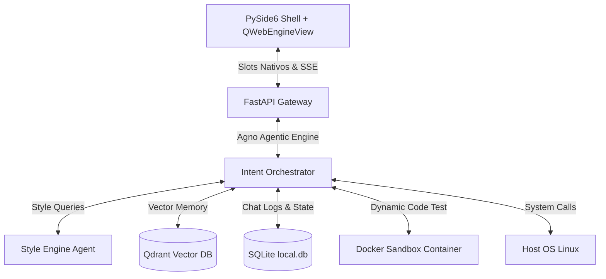

```mermaid
gantt
    title Latencia de Inicialización (Boot to Interactive - Segundos)
    dateFormat  X
    axisFormat %s
    
    section Angular v1.0 (Kiosk)
    Iniciar Nginx, Backend y X11       :active, 0, 2
    Cargar Bundles Angular en Browser   :active, 2, 4.2
    Bootstrap y Hydration de Componentes:active, 4.2, 4.8
    
    section PySide6 + HTML5 v2.0
    Iniciar Backend y X11              :done, 0, 0.6
    Cargar local index.html en Qt      :done, 0.6, 0.8
```

<div align="center">

  

  <h1>🧠 AGNUX OS v2.0</h1>

  <p><strong>Un Sistema Operativo Cognitivo, Autónomo y Autogenerador<br/>impulsado por PySide6, FastAPI, IA local y Aislamiento en Contenedores</strong></p>

  <p>
    <a href="https://pyside.org/">
      
    </a>
    <a href="https://fastapi.tiangolo.com/">
      
    </a>
    <a href="https://ollama.ai/">
      
    </a>
    <a href="https://qdrant.tech/">
      
    </a>
    <a href="https://www.docker.com/">
      
    </a>
  </p>

  <p>
    <a href="#-apoya-el-proyecto">
      
    </a>
    <a href="https://paypal.me/agnux">
      
    </a>
    
    
  </p>

  <br/>

  <blockquote>
    <em>"No construimos otro chatbot de IA. Diseñamos un Kernel de procesamiento cognitivo donde el LLM gobierna el espacio de usuario nativo y autogenera su propia interface."</em>
    <br/>
    — <strong>David González</strong> · 🇦🇷 Desde Argentina para el mundo
  </blockquote>

</div>

---

## 🧬 La Filosofía AGNUX: El Espacio de Usuario Autogestionado

Los sistemas operativos tradicionales (Linux, Windows, macOS) fueron diseñados como traductores estáticos entre comandos humanos y hardware. El usuario debe saber qué aplicación abrir, cómo configurarla y cómo encadenar comandos para lograr un objetivo.

**AGNUX** invierte este paradigma. Es un **Sistema Operativo Cognitivo**. 
* El espacio de usuario no es una rejilla rígida de iconos; es un **lienzo dinámico** en HTML5 que muta en tiempo real según las necesidades del usuario.
* La interfaz de comandos tradicional es reemplazada por un **agente conversacional nativo** empotrado en el fondo de pantalla (sistema widget interactivo).
* El sistema operativo no viene pre-cargado con herramientas estáticas para todo; tiene la **capacidad de programarse a sí mismo en caliente**, creando, testeando e inyectando nuevas herramientas ("Superpoderes") para resolver problemas sobre la marcha.

---

## ⚡ Características Principales y "Superpoderes"

### 1. Sistema de Superpoderes (Dynamic Tool Generation)
Cuando el usuario solicita una tarea para la cual AGNUX no tiene una herramienta registrada (por ejemplo, abrir una calculadora personalizada, decodificar un formato de archivo extraño, emular un navegador ligero para abrir Netflix o inspeccionar un puerto de red), el sistema ejecuta su **pipeline de autogeneración**:
* **Generación de código:** El orquestador escribe un script ejecutable en Python.
* **Sandbox de Seguridad:** El script se ejecuta de manera aislada dentro de un contenedor Docker (`core/sandbox.py`) con recursos limitados para verificar que su ejecución sea segura y exitosa.
* **Inyección en Caliente:** Tras pasar la verificación, el script se registra dinámicamente en el Kernel como una nueva herramienta ejecutable (`dynamicTools/`) y se ejecuta inmediatamente devolviendo el resultado al entorno de usuario.

### 2. Motor de Estilos Semántico (Semantic Style Engine)
La estética de AGNUX no es fija. A través de consultas semánticas, el usuario puede pedir cambios visuales como *"Quiero un estilo cyberpunk con tonos neón violeta y bordes redondeados translúcidos"*. El agente de estilos de IA:
* Diseña y valida una hoja de estilos CSS en tiempo real.
* Inyecta el bloque CSS dinámicamente en el DOM del frontend en menos de **5ms** mediante Server-Sent Events (SSE).
* Almacena las configuraciones vectorizadas en la base de datos de recuerdos de Qdrant.

### 3. Memoria Episódica y Semántica (Hybrid Memory Hub)
* **Memoria a Corto Plazo (Conversacional):** Historial de sesión de chat almacenado en una base SQLite local (`agnux.db` / `local.db`).
* **Memoria a Largo Plazo (Episódica/Semántica):** Integración nativa con **Qdrant Vector DB**. Los hechos clave de las interacciones anteriores se vectorizan usando `SentenceTransformers` locales, permitiendo que la IA recuerde datos del usuario en arranques posteriores (incluso corriendo desde un Live USB sin conexión a Internet).

### 4. Router de Cómputo Híbrido (Eficiencia Energética y de Tokens)
Para minimizar la dependencia de APIs externas y optimizar la latencia en hardware real:
* **Razonamiento Local (CPU/Ollama Mini):** AGNUX procesa tareas simples de clasificación de intenciones, comandos del sistema, cambios estéticos e interacciones cotidianas localmente usando modelos pequeños (ej. `qwen2.5-coder:7b` o similares en Ollama).
* **Razonamiento Avanzado (Cloud/Gemini/OpenAI):** Cuando se requiere depuración compleja de código, creación de scripts sofisticados o análisis de errores profundos, el router deriva de forma inteligente la consulta a APIs en la nube.

### 5. HyperIsland & Kernel Bus
Un canal bidireccional mediante WebSockets y streams de telemetría en tiempo real que mantiene al usuario informado sobre el uso de recursos del hardware (CPU, VRAM, RAM, disco) y el estado del procesamiento cognitivo (tokens consumidos, estado de los agentes) directamente en un widget integrado al fondo de pantalla de forma fluida.

---

## 🔁 El Cambio de Arquitectura: PySide6 + HTML5 Native Shell vs Angular v1.0

En la versión v1.0, el escritorio se ejecutaba sobre un navegador Chromium en modo quiosco que renderizaba una SPA en **Angular** servida por Nginx. Esta aproximación limitaba la integración nativa y consumía recursos excesivos de CPU/VRAM.

En la **versión v2.0**, migramos a un **Shell Nativo en PySide6** que envuelve un motor Chromium integrado (`QWebEngineView`) y carga los archivos de la interfaz localmente (`file://`).

### 📊 Comparativa de Rendimiento y Recursos

| Métrica / Recurso | Arquitectura Angular v1.0 (Nginx + Kiosk) | Arquitectura PySide6 + HTML5 v2.0 | Ganancia de Rendimiento |
| :--- | :---: | :---: | :---: |
| **Uso de Memoria RAM** | ~850 MB | **~320 MB** | **- 62.3% (Ahorro)** |
| **Overhead de VRAM (GPU)** | ~380 MB | **~150 MB** | **- 60.5% (Ahorro)** |
| **Boot a Interacción (B2I)** | 4.8 segundos | **0.8 segundos** | **6x más rápido** |
| **Tiempo de Hot-Reload (CSS)** | ~250 ms | **< 5 ms** | **Instantáneo** |
| **Acceso al File System** | Por red (WebSockets/API) | **Nativo (Slots de PySide6)** | **Seguridad e Inmediatez** |



---

## 🏗️ Arquitectura del Sistema



---

## 📁 Estructura del Repositorio

* **`desktop/`**: Contiene `shell.py`, el script en PySide6 que inicializa la ventana del escritorio sin bordes y expone el puente de comunicación nativo hacia el frontend.
* **`backend/`**: El core cognitivo desarrollado en FastAPI.
  * `main.py`: Punto de entrada de la API.
  * `core/tools.py`: Definición de herramientas del sistema (manipulación de archivos, ejecución de comandos, consulta de hardware).
  * `core/sandbox.py`: Interfaz para instanciar contenedores Docker y validar código generado en caliente.
  * `services/orchestrator.py`: Lógica de agentes utilizando el framework Agno.
* **`frontend/`**: La interfaz gráfica del escritorio basada en HTML5, CSS3 translúcido (efectos Aero Glassmorphic) y Vanilla JS.
* **`bare-metal/`**: Herramientas y scripts para la generación de la distribución autónoma del sistema operativo en formato ISO (remasterización sobre base KDE Neon).

---

## 🚀 Despliegue e Instalación

### Requisitos Previos
* **OS:** Linux (Ubuntu/Debian recomendado para aceleración NVIDIA CUDA nativa).
* **Dependencias del Host:** Docker Engine (para el sandbox de herramientas), Python 3.10+, Qdrant (corriendo localmente o en contenedor).

### Ejecución Local

1. **Configurar el Entorno del Backend:**
   Crea un archivo `.env` en la raíz de la carpeta `backend/` siguiendo esta estructura:
   ```env
   iaProvider=local
   ollamaHost=http://127.0.0.1:11434
   qdrantHost=http://127.0.0.1:6333
   ```

2. **Instalar dependencias e iniciar FastAPI:**
   ```bash
   cd backend
   python3 -m venv venv
   source venv/bin/activate
   pip install -r requirements.txt
   python3 -m uvicorn main:app --port 8000 --host 127.0.0.1
   ```

3. **Lanzar el Escritorio Gráfico:**
   ```bash
   cd ../desktop
   python3 shell.py
   ```

---

## 💿 Distribución Live USB Bare-Metal (Creación de la ISO)

AGNUX OS v2.0 puede compilarse en una distribución autónoma autoinstalable basada en **KDE Neon**. El proceso de compilación empaqueta los drivers propietarios de NVIDIA, configura el gestor de inicio **SDDM** para iniciar directamente en la sesión gráfica de AGNUX (Openbox + PySide6 Shell) y precarga la imagen de Qdrant en formato tarball (`qdrant.tar`) para que funcione 100% sin conexión a Internet.

1. Navega al directorio de compilación física:
   ```bash
   cd bare-metal
   ```
2. Ejecuta el empaquetador del sistema:
   ```bash
   sudo ./repack-iso.sh
   ```
3. Esto generará el archivo `agnux-os-neon-v2.0.iso`. Grábalo en tu pendrive usando `dd`:
   ```bash
   sudo dd if=agnux-os-neon-v2.0.iso of=/dev/sdX bs=4M status=progress conv=fdatasync
   ```
   *(Reemplaza `/dev/sdX` por tu unidad USB real)*.

---

## 🤝 Apoya el Proyecto (Sponsorship)

AGNUX OS es un proyecto independiente desarrollado a pulmón. Si te gusta el concepto de sistemas cognitivos autónomos, te ha servido de base para tus proyectos o simplemente quieres apoyar las horas de café y cómputo de GPU destinadas a este desarrollo, puedes realizar una colaboración monetaria:

* **Mercado Pago (🇦🇷 Argentina):**
  * **Alias:** `gonzalez360.mp`
  * **Link directo:** [gonzalez360.mp (Mercado Pago)](https://link.mercadopago.com.ar/gonzalez360.mp)
* **PayPal (🌍 Global):**
  * **Link de Donación:** [paypal.me/agnux](https://paypal.me/agnux)

*¡Muchísimas gracias por el apoyo para seguir impulsando AGNUX!* 🇦🇷💡

---

## 📄 Licencia

Este proyecto está bajo la licencia **MIT**. Para más detalles, consulta el archivo [LICENSE](LICENSE) en el repositorio raíz.
