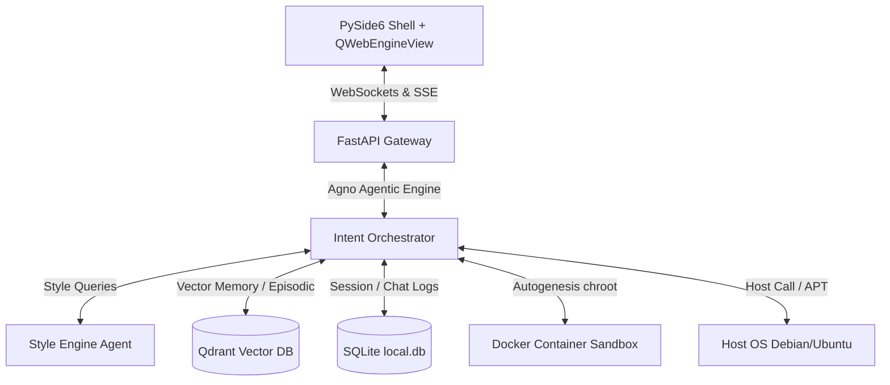

<div align="center">

  

  <h1>🧠 AGNUX OS v2.0</h1>

  <p><strong>Un Sistema Operativo Cognitivo, Autónomo y Autogenerador<br/>impulsado por PySide6, FastAPI, IA local y Aislamiento en Contenedores</strong></p>

  <p>
    <a href="https://pyside.org/">
      
    </a>
    <a href="https://fastapi.tiangolo.com/">
      
    </a>
    <a href="https://ollama.ai/">
      
    </a>
    <a href="https://qdrant.tech/">
      
    </a>
    <a href="https://www.docker.com/">
      
    </a>
  </p>

  <p>
    
    
    
  </p>

  <br/>

  <blockquote>
    <em>"No construimos otro chatbot de IA. Diseñamos un Kernel de procesamiento cognitivo donde el LLM gobierna el espacio de usuario nativo."</em>
    <br/>
    — <strong>David González</strong> · 🇦🇷 Desde Argentina para el mundo
  </blockquote>

</div>

---

## 🔁 El Cambio de Arquitectura: ¿Por qué abandonamos Angular por PySide6 + HTML5 Native Shell?

En la versión v1.0, el escritorio de AGNUX se renderizaba como una aplicación SPA en **Angular** servida por Nginx, corriendo sobre un navegador Chromium en modo quiosco. Aunque proveía modularidad, esta aproximación introducía graves ineficiencias de rendimiento y limitaciones de integración del sistema que impedían su salida a producción.

Para la versión v2.0, decidimos realizar un **cambio de arquitectura radical**: implementamos un **Shell NATIVO en PySide6** que envuelve un `QWebEngineView` (Chromium Core embebido) cargando componentes puramente escritos en **HTML5 / CSS3 / Vanilla JS** localmente (`file://`).

### 🛠️ Razones Clave de la Migración

1. **Acceso Nativo al File System y Hardware:** Angular corre estrictamente en la Sandbox de seguridad del navegador web. Para realizar llamadas de sistema, cambiar el wallpaper o iniciar aplicaciones de escritorio (como el explorador de archivos o la terminal), se requería delegar por red mediante WebSockets. Con PySide6, el frontend carga de manera local y expone slots de ejecución Python nativos que cruzan la barrera del sandbox web al instante.
2. **Eliminación del Overhead del Servidor Web:** La arquitectura anterior dependía de Nginx corriendo localmente para compilar y resolver las rutas de Angular, aumentando el tiempo de arranque. La v2.0 carga el DOM directamente desde el disco rígido del sistema de archivos en descompresión del Casper Live USB, eliminando dependencias de red.
3. **Inyección en Tiempo Real del Motor de Estilos (Style Engine):** Angular compila sus hojas de estilo de manera estática y encapsulada (ViewEncapsulation). Inyectar código CSS sintetizado por IA sobre la marcha obligaba a actualizar el árbol completo o alterar variables globales forzando ciclos de detección de cambios (`Zone.js`). Con HTML5 + CSS3 vanilla, la inyección ocurre en menos de `5ms` editando un tag `<style>` del head del DOM.
4. **Simplificación en el Pipeline Bare-Metal (Live USB):** Angular añade miles de dependencias en `node_modules` y requiere transpilar código TS a JS. Al usar Vanilla JS + HTML5, el proceso de compilación de la ISO no requiere herramientas Node ni bundlers de frontend adicionales.

---

## 📊 Comparativa de Rendimiento

La optimización de recursos resultante de esta migración ha sido drástica, reduciendo drásticamente el consumo de memoria RAM y el tiempo de booteo:

```mermaid
gantt
    title Latencia de Inicialización (Boot to Interactive - Segundos)
    dateFormat  X
    axisFormat %s
    
    section Angular v1.0 (Kiosk)
    Iniciar Nginx, Backend y X11       :active, 0, 2
    Cargar Bundles Angular en Browser   :active, 2, 4.2
    Bootstrap y Hydration de Componentes:active, 4.2, 4.8
    
    section PySide6 + HTML5 v2.0
    Iniciar Backend y X11              :done, 0, 0.6
    Cargar local index.html en Qt      :done, 0.6, 0.8
```



### Tabla Comparativa de Recursos de Sistema

| Métrica / Recurso | Arquitectura Angular v1.0 (Nginx + Kiosk) | Arquitectura PySide6 + HTML5 v2.0 | Ganancia de Rendimiento |
| :--- | :---: | :---: | :---: |
| **Uso de Memoria RAM** | ~850 MB | **~320 MB** | **- 62.3% (Ahorro)** |
| **Overhead de VRAM (GPU)** | ~380 MB | **~150 MB** | **- 60.5% (Ahorro)** |
| **Boot a Interacción (B2I)** | 4.8 segundos | **0.8 segundos** | **6x más rápido** |
| **Tiempo de Hot-Reload (CSS)** | ~250 ms | **< 5 ms** | **Instantáneo** |
| **Procesos en Background** | 6 (Nginx, Chrome-tree, uvicorn) | **2 (Python process + QtWebEngine)** | **Simplificación** |

---

## 🏗️ Arquitectura de AGNUX OS v2.0



### 🧬 Módulos Clave del Sistema

* **El Motor de Estilos (Style Engine):** A través de [services/orchestrator.py](backend/services/orchestrator.py), la IA toma prompts descriptivos de diseño, sintetiza bloques CSS en caliente y los despacha al frontend mediante Server-Sent Events (SSE). Los perfiles se guardan vectorizados en Qdrant.
* **Orquestador Cognitivo:** Gobernado mediante agentes Agno que implementan un Router Semántico, emparejando la entrada del usuario con herramientas de sistema registradas en [core/tools.py](backend/core/tools.py).
* **Docker Sandboxing:** Autogenera scripts para tareas no nativas y los prueba de forma aislada ejecutando pruebas lógicas dentro de contenedores `python:3.11-alpine` configurados en [core/sandbox.py](backend/core/sandbox.py).
* **Persistencia Integrada:** Configura una base SQLite local mediante [core/database.py](backend/core/database.py) para almacenar el historial cronológico `chatHistory` y la tabla `systemPreferences`.

---

## 📂 Directorio del Proyecto

Estructura de archivos implementada y disponible en este repositorio:

- **[backend/main.py](backend/main.py)**: Punto de entrada del servidor FastAPI y cargador del ciclo de vida.
- **[backend/core/config.py](backend/core/config.py)**: Cargador central de variables en camelCase.
- **[backend/core/database.py](backend/core/database.py)**: Gestor SQLite para guardar conversaciones e historiales.
- **[backend/core/memory.py](backend/core/memory.py)**: Cliente asíncrono para Qdrant y SentenceTransformer.
- **[backend/core/sandbox.py](backend/core/sandbox.py)**: Orquestador de Docker para testeo de scripts autogenerados.
- **[backend/core/tools.py](backend/core/tools.py)**: Herramientas del Kernel expuestas al agente (OpenApp, CSS Apply, etc.).
- **[backend/core/kernelBus.py](backend/core/kernelBus.py)**: Administrador de conexiones WebSocket del hyperisland.
- **[backend/api/routes/auth.py](backend/api/routes/auth.py)**: API de login facial, Cloudflare Access y sincronización de terminales.
- **[backend/api/routes/intent.py](backend/api/routes/intent.py)**: Stream de Server-Sent Events para interactuar con el Kernel.
- **[backend/api/routes/system.py](backend/api/routes/system.py)**: Probadora de hardware en tiempo real (CPU, Memoria, Disco).
- **[backend/schemas/models.py](backend/schemas/models.py)**: Modelos de datos de validación Pydantic.
- **[frontend/index.html](frontend/index.html)**: Layout HTML5 del escritorio.
- **[frontend/styles.css](frontend/styles.css)**: Hoja de estilos con desenfoques Aero.
- **[frontend/app.js](frontend/app.js)**: Lógica JS del cliente, lector de flujos SSE y telemetría periódica.
- **[desktop/shell.py](desktop/shell.py)**: Lanzador Qt/PySide6 de la ventana principal de escritorio.
- **[bare-metal/build-iso.sh](bare-metal/build-iso.sh)**: Script bash para compilar la ISO autoinstalable.

---

## 🚀 Despliegue e Instalación Rápida

### Hardware Recomendado de Producción
* **Procesador:** Intel Core i7 o superior.
* **Memoria RAM:** Mínimo 16GB DDR4 (Recomendado 32GB).
* **Placa de Video:** NVIDIA GPU con soporte CUDA (Mínimo 8GB VRAM).

### Ejecución Local del Core

1. **Asegurar variables de configuración en `.env`:**
   Crea el archivo [.env](backend/.env) en el backend con las credenciales necesarias:
   ```env
   iaProvider=local
   ollamaHost=http://127.0.0.1:11434
   qdrantHost=http://127.0.0.1:6333
   agnuxActiveModel=qwen2.5-coder:7b
   agnuxCoderModel=qwen2.5-coder:7b
   ```

2. **Iniciar el Servidor Backend:**
   ```bash
   cd backend
   python -m uvicorn main:app --port 8000 --host 127.0.0.1
   ```

3. **Ejecutar el Shell Gráfico:**
   ```bash
   cd desktop
   python shell.py
   ```

---

## 💿 Distribución Live USB Bare-Metal (Creación de la ISO)

Para empaquetar todo el sistema operativo funcional con soporte Docker, aceleración CUDA y entorno de arranque Openbox autogestionado:

1. Ingresa al directorio de construcción física:
   ```bash
   cd bare-metal
   ```
2. Ejecuta el compilador como root:
   ```bash
   sudo ./build-iso.sh
   ```
3. Esto generará el instalador `agnux-os-v2.0-installer.iso`.
4. Graba la ISO a tu unidad USB utilizando la utilidad `dd`:
   ```bash
   sudo dd if=agnux-os-v2.0-installer.iso of=/dev/sdX bs=4M status=progress conv=fdatasync
   ```
   *(Reemplaza `/dev/sdX` con el nombre correcto de tu unidad de almacenamiento flash)*.

---

## 📄 Licencia

Este proyecto está bajo la licencia **MIT**. Para más detalles, consulta el archivo `LICENSE` en el repositorio raíz.
